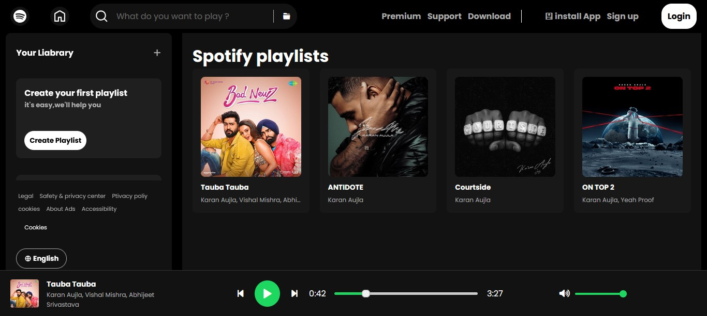

# 🎵 Custom Music Player (Spotify-Inspired)

I created this project from scratch to test myself and apply everything I've learned about frontend development so far. Instead of following a tutorial or copying an existing challenge, I built this music player UI and logic on my own to simulate a real-world frontend project.

## 📑 Table of Contents

- [Overview](#overview)
  - [The Challenge](#the-challenge)
  - [Screenshot](#screenshot)
  - [Links](#links)
- [My Process](#my-process)
  - [Built With](#built-with)
  - [What I Learned](#what-i-learned)
  - [Continued Development](#continued-development)
  - [Useful Resources](#useful-resources)
- [Author](#author)

---

## 🧐 Overview

### ✅ The Challenge

Users should be able to:

- View a Spotify-like music player UI.
- Click on music cards to load and play songs.
- Use a bottom-fixed player bar to control playback.
- Play, pause, skip forward or back.
- Drag a progress bar and see timestamps update.
- Adjust volume using a green-filled slider.
- Get visual feedback (like icon toggles, progress fill, and error handling).

---

### 🖼️ Screenshot

---
### 🔗 Links

- Solution URL: [GitHub Repository](https://github.com/C-W-Praduman/Spotify-music-player)
- Live Site URL: [Live Demo](https://clone-spotify-music-one.vercel.app/)

---

## 🛠️ My Process

### 🔧 Built With

- Semantic **HTML5** markup
- **CSS3** (Flexbox + Custom Scrollbars + CSS Variables)
- **JavaScript** (Vanilla)
- **Mobile-first** workflow

---

### 📚 What I Learned

This project helped me:
- Understand the logic behind audio playback and player controls.
- Work with DOM events to build an interactive music experience.
- Use CSS for custom sliders (volume and timeline) with dynamic color fill.
- Handle edge cases like playing the first song by default or avoiding NaN durations.
- Practice the frontend mindset of thinking through UX and polishing every detail.

---
### 🔁 Continued Development

In future updates, I plan to:

- Add a dark/light theme toggle.
- Add repeat, shuffle, and custom queue support.
- Possibly rebuild this with **React.js** and **Firebase** as a full-stack music app.

---

### 🌍 Useful Resources

- [MDN Web Docs](https://developer.mozilla.org/) – For core JavaScript and audio documentation.
- [CSS Tricks](https://css-tricks.com/) – For custom range input styling and flexbox patterns.
- [Google Fonts](https://fonts.google.com/) – For typography styling inspiration.

---

### 👨‍💻 Author

- GitHub – [@yourusername](https://github.com/yourusername)
---
